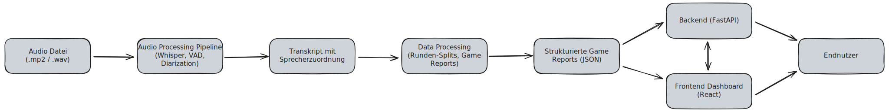

# Matrix Wargame Analyzer

Ein umfassendes System zur Analyse von Matrix Wargame Sessions mit Audio-Transkription, Sprechererkennung, KI-gestützter Spielanalyse und interaktivem Dashboard.

## Quick Start

```bash
# Backend starten
cd backend
fastapi dev app/main.py

# Frontend starten (neues Terminal)
cd frontend
npm run dev
```

**Dashboard:** http://localhost:5173  
**API:** http://localhost:8000

## Projektübersicht

Dieses Projekt analysiert Audio-Aufnahmen von Matrix Wargame Sessions und erstellt detaillierte Game Reports. Die Pipeline umfasst Audio-Verarbeitung, automatische Transkription mit Sprechererkennung, KI-gestützte Spielanalyse und ein Web-Dashboard zur Visualisierung der Ergebnisse.

## Datenfluss-Architektur



## Modell-Übersicht

| Modell | Lizenz | Verwendungszweck |
|--------|--------|------------------|
| **Whisper Large-v3** (faster-whisper) | MIT | Automatische Spracherkennung (ASR) - Audio → Text |
| **pyannote/speaker-diarization** | MIT | Grobe Sprechererkennung & Clustering |
| **pyannote/vad** | MIT | Voice Activity Detection (VAD) |
| **SpeechBrain ECAPA-TDNN** | Apache 2.0 | Speaker Embeddings (192-dim Vektoren) |
| **PyTorch** (CUDA 12.1) | BSD-3-Clause | Deep Learning Framework für alle Modelle |

## Tech Stack

- **Audio Processing**: Whisper Large-v3, PyAnnote, SpeechBrain, PyTorch (CUDA 12.1)
- **Backend**: FastAPI 0.122.0+, Python 3.10+
- **Frontend**: React 19, TypeScript 5.9, Vite 7.2, Tailwind CSS 4.1, React Router 7.9, Recharts 3.5

## Dateistruktur

```
hackathon_2025_buggybutlucky/
├── v5_1_pipeline/          # Audio Processing Pipeline
│   ├── main.py
│   ├── asr/                # Whisper Transkription
│   ├── diarization/        # Sprechererkennung
│   └── roles/              # Rollenzuordnung
├── data_processing/        # KI-Analyse & Reports
│   ├── wargame_analyzer.py
│   ├── pipeline.py
│   └── generate_onepager.py
├── backend/                # FastAPI Server
│   └── app/
└── frontend/               # React Dashboard
    └── src/
```

## Systemarchitektur

### 1. Audio Processing Pipeline (v5_1_pipeline)

Hochqualitative Audio-zu-Text-Pipeline mit Sprechererkennung.

**Pipeline-Schritte:**
1. **ASR** - Whisper Large-v3 für hochpräzise Transkription
2. **VAD** - Voice Activity Detection für Sprachsegmente
3. **Diarization** - Sprechererkennung mit Speaker Embeddings (192-dim)
4. **Clustering** - Hierarchisches Clustering der Sprecher
5. **Role Inference** - Automatische Rollenzuordnung (Spielleiter, Team Rot, Team Blau)

**Features:**
- GPU-Beschleunigung via CUDA 12.1
- Zeitstempel-Erhaltung für Frame-genaue Zuordnung
- Robuste Pipeline mit Fehlerbehandlung

### 2. Data Processing & Analysis (data_processing)

KI-gestützte Analyse der Transkripte mit strukturierter Ausgabe.

**WargameAnalyzer Funktionen:**

| Funktion | Beschreibung |
|----------|--------------|
| `split_rounds()` | Erkennt Rundengrenzen automatisch |
| `split_transcript_by_rounds()` | Teilt Transkript in Runden auf |
| `generate_report_for_round()` | KI-gestützte Spielanalyse pro Runde |

**Ausgabe:**
- Strukturierte Game Reports (JSON) nach Matrix Wargame Regelwerk
- OnePager für schnelle Übersicht
- Teilnehmer-Extraktion und Angriffsergebnisse

### 3. Backend API (backend)

FastAPI-basierter Server für Audio-Upload und -Verarbeitung.

**API Endpoints:**

| Endpoint | Methode | Beschreibung |
|----------|---------|--------------|
| `/audio/upload` | POST | Audio-Datei hochladen |
| `/audio/process` | POST | Audio-Verarbeitung starten |
| `/reports/{id}` | GET | Game Report abrufen |

### 4. Frontend Dashboard (frontend)

React + TypeScript Dashboard zur Visualisierung der Analyseergebnisse.

**Seiten:**
- `/upload` - Audio Upload mit Drag & Drop
- `/` - Dashboard-Übersicht aller Spiele
- `/report/:id` - Detaillierte Report-Ansicht

## Installation

### Voraussetzungen

| Software | Version | Zweck |
|----------|---------|-------|
| Python | 3.10+ | Backend & Processing |
| Node.js | 18+ | Frontend |
| CUDA | 12.1 | GPU-Beschleunigung |
| ffmpeg | Latest | Audio-Verarbeitung |
| Conda | Latest | PyTorch Installation |

### 1. Audio Processing Pipeline

```bash
cd v5_1_pipeline

# Conda Umgebung für PyTorch
conda install pytorch pytorch-cuda=12.1 -c pytorch -c nvidia
conda install torchvision torchaudio -c pytorch

# Python Dependencies
pip install -r requirements.txt

# PyAnnote.audio separat (ohne deps)
pip install pyannote.audio==3.1.1 --no-deps
```

### 2. Backend

```bash
cd backend
pip install -e .
```

### 3. Frontend

```bash
cd frontend
npm install
```

## Konfiguration

Erstelle eine `config.json` im Root-Verzeichnis:

```json
{
  "openrouter_api_key": "sk-or-v1-...",
  "model": "anthropic/claude-3.5-sonnet",
  "max_tokens": 150000,
  "temperature": 0.1
}
```

⚠️ **Wichtig:** Die `config.json` ist in `.gitignore` und sollte niemals committed werden!

## Features

### ✅ Implementiert

- Automatische Sprechererkennung mit hochpräziser Diarization
- KI-gestützte Spielanalyse mit Claude 3.5 Sonnet
- Strukturierte Game Reports nach Matrix Wargame Regelwerk
- OnePager-Reports für schnelle Übersicht
- Robustes JSON-Parsing mit automatischer Fehlerkorrektur
- Modulare Pipeline-Architektur für flexible Erweiterungen
- React Dashboard mit modernem UI
- Audio Upload via FastAPI
- Backend-Frontend Integration
- Echtzeit-Verarbeitung
- Multi-Game Verwaltung
- Export-Funktionen (PDF, CSV)

## Team

**Team BuggyButLucky** - Hackathon 2025

---