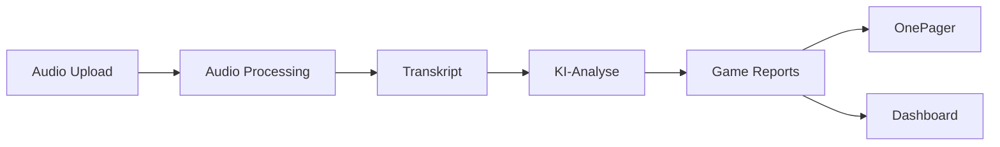

# Matrix Wargame Analyzer

Ein umfassendes System zur Analyse von Matrix Wargame Sessions mit Audio-Transkription, Sprechererkennung, KI-gestützter Spielanalyse und interaktivem Dashboard.

## Projektübersicht

Dieses Projekt analysiert Audio-Aufnahmen von Matrix Wargame Sessions und erstellt detaillierte Game Reports. Die Pipeline umfasst Audio-Verarbeitung, automatische Transkription mit Sprechererkennung, KI-gestützte Spielanalyse und ein Web-Dashboard zur Visualisierung der Ergebnisse.

## Datenfluss-Architektur

```
            ┌─────────────────┐
            │  Audio-Datei    │
            │   (.mp3/.wav)   │
            └────────┬────────┘
                     │
                     ▼
┌─────────────────────────────────────────────┐
│    v5_1_pipeline (Audio Processing)         │
│  ┌──────────┐  ┌──────────┐  ┌──────────┐   │
│  │ Whisper  │→ │   VAD    │→ │Diariza-  │   │
│  │   ASR    │  │          │  │  tion    │   │
│  └──────────┘  └──────────┘  └──────────┘   │
│                       │                     │
│                       ▼                     │
│              ┌─────────────────┐            │
│              │ Role Inference  │            │
│              └─────────────────┘            │
└────────────────────┬────────────────────────┘
                     │
                     ▼
         ┌───────────────────────┐
         │  Transkript mit       │
         │  Sprecherzuordnung    │
         └───────────┬───────────┘
                     │
                     ▼
┌─────────────────────────────────────────────┐
│    data_processing (KI-Analyse)             │
│  ┌─────────────────┐  ┌─────────────────┐   │
│  │ WargameAnalyzer │→ │OnePage Generator│   │
│  │  - Runden Split │  │  - Kombination  │   │
│  │  - Game Reports │  │  - Zusammenfass.│   │
│  └─────────────────┘  └─────────────────┘   │
└────────────────────┬────────────────────────┘
                     │
                     ▼
         ┌───────────────────────┐
         │  Strukturierte        │
         │  Game Reports (JSON)  │
         └───────────┬───────────┘
                     │
         ┌───────────┴───────────┐
         │                       │
         ▼                       ▼
┌────────────────┐     ┌────────────────┐
│    Backend     │     │    Frontend    │
│   (FastAPI)    │◄───►│   (React)      │
│                │     │   Dashboard    │
└────────────────┘     └────────────────┘
         │                       │
         └───────────┬───────────┘
                     ▼
            ┌─────────────────┐
            │   Endnutzer     │
            │  (Web Browser)  │
            └─────────────────┘
```

## Modell-Übersicht

| Modell | Lizenz | Verwendungszweck |
|--------|--------|------------------|
| **Whisper Large-v3** (faster-whisper) | MIT | Automatische Spracherkennung (ASR) - Audio → Text |
| **pyannote/speaker-diarization** | MIT | Grobe Sprechererkennung & Clustering |
| **pyannote/vad** | MIT | Voice Activity Detection (VAD) |
| **SpeechBrain ECAPA-TDNN** | Apache 2.0 | Speaker Embeddings (192-dim Vektoren) |
| **Claude 3.5 Sonnet** (OpenRouter) | Proprietär | KI-gestützte Spielanalyse & Report-Generierung |
| **GPT-4o** (OpenRouter) | Proprietär | Alternative für KI-Analyse (optional) |
| **PyTorch** (CUDA 12.1) | BSD-3-Clause | Deep Learning Framework für alle Modelle |

## Komponenten-Übersicht

| Komponente | Technologie | Hauptfunktion | Status |
|------------|-------------|---------------|---------|
| **v5_1_pipeline** | Python, Whisper, PyTorch | Audio → Transkript mit Sprechererkennung | ✅ Produktiv |
| **data_processing** | Python, OpenRouter API | Transkript → Game Reports (KI-Analyse) | ✅ Produktiv |
| **backend** | FastAPI | RESTful API für File Upload | ✅ Produktiv |
| **frontend** | React, TypeScript, Tailwind | Dashboard & Visualisierung | ✅ Produktiv |

## Systemarchitektur

### 1. Audio Processing Pipeline (v5_1_pipeline)

Hochqualitative Audio-zu-Text-Pipeline mit Sprechererkennung.

#### Pipeline-Schritte

| Schritt | Komponente | Beschreibung | Output |
|---------|------------|--------------|---------|
| 1 | **ASR** | Whisper Large-v3 für hochpräzise Transkription | Wort-Zeitstempel |
| 2 | **VAD** | Voice Activity Detection für Sprachsegmente | Aktive Segmente |
| 3 | **Coarse Diarization** | Grobe Sprechererkennung | Sprecher-Segmente |
| 4 | **Embeddings** | Speaker Embeddings (SpeechBrain) | 192-dim Vektoren |
| 5 | **Clustering** | Hierarchisches Clustering (AHC) | Sprecher-Labels |
| 6 | **Smoothing** | Label-Stabilisierung | Geglättete Labels |
| 7 | **Merge** | Wort → Utterance Konsolidierung | Strukturierte Äußerungen |
| 8 | **Normalize** | Text-Normalisierung | Bereinigte Utterances |
| 9 | **Role Inference** | Automatische Rollenzuordnung | Spielleiter, Rot, Blau |

#### Key Features

- **Präzise Sprechererkennung** mit Speaker Embeddings
- **GPU-Beschleunigung** via CUDA 12.1
- **Robuste Pipeline** mit Fehlerbehandlung
- **Zeitstempel-Erhaltung** für Frame-genaue Zuordnung

#### Hauptdateien

```
v5_1_pipeline/
├── main.py                    # Pipeline-Orchestrierung
├── asr/
│   ├── transcribe.py         # Whisper ASR
│   └── whisper_config.py     # Whisper-Konfiguration
├── diarization/
│   ├── vad.py                # Voice Activity Detection
│   ├── coarse.py             # Coarse Diarization
│   ├── embeddings.py         # Speaker Embeddings
│   ├── clustering.py         # Hierarchisches Clustering
│   ├── smoothing.py          # Label-Glättung
│   └── merge.py              # Utterance-Merge
├── roles/
│   └── infer.py              # Rollenerkennung
└── requirements.txt          # Python Dependencies
```

### 2. Data Processing & Analysis (data_processing)

KI-gestützte Analyse der Transkripte mit strukturierter Ausgabe.

#### WargameAnalyzer Funktionen

| Funktion | Input | Output | Beschreibung |
|----------|-------|--------|--------------|
| `split_rounds()` | Transkript, Prompt | JSON mit Zeitstempeln | Erkennt Rundengrenzen automatisch |
| `split_transcript_by_rounds()` | Zeitstempel-JSON | Runden-Dateien (.txt) | Teilt Transkript physisch auf |
| `generate_report_for_round()` | Runden-Text | Game Report (JSON) | KI-gestützte Spielanalyse |

#### OnePager Generator Features

- **Teilnehmer-Extraktion**: Identifiziert Team Rot & Blau
- **Angriffsergebnisse**: Erfolg/Misserfolg je Runde
- **Verteidigungsanalyse**: Stärken & Schwächen
- **Schwachstellen-Mapping**: Welche Vulnerabilities wurden ausgenutzt?
- **Detaillierte Phasen-Auswertung**: Phase 1 (Aufklärung) & Phase 2 (Angriff)

#### Verwendete KI-Modelle

| Modell | Provider | Verwendung | Max Tokens |
|--------|----------|------------|------------|
| Claude 3.5 Sonnet | OpenRouter | Standard-Analyse | 150.000 |
| GPT-4o | OpenRouter | Alternative (optional) | 150.000 |

#### Hauptdateien

```
data_processing/
├── wargame_analyzer.py       # Hauptanalyse-Klasse
├── pipeline.py               # Vollständige Pipeline
├── generate_onepager.py      # Report-Zusammenfassung
└── data/
    ├── transcript.txt        # Input: Transkript
    └── reports/
        ├── rounds_overview.json
        ├── round1_report.json
        ├── round2_report.json
        ├── game_report_combined.json
        └── game_onepager.txt
```

### 3. Backend API (backend)

FastAPI-basierter Server für Audio-Upload und -Verarbeitung.

#### API Endpoints

| Endpoint | Methode | Beschreibung | Status |
|----------|---------|--------------|--------|
| `/audio/upload` | POST | Audio-Datei hochladen | ✅ Aktiv |
| `/audio/process` | POST | Audio-Verarbeitung starten | 🚧 In Entwicklung |
| `/reports/{id}` | GET | Game Report abrufen | 🚧 In Entwicklung |

#### Tech Stack

```
backend/
├── app/
│   ├── main.py               # FastAPI App
│   └── routers/
│       └── audio.py          # Audio Upload Router
└── pyproject.toml            # Dependencies
```

**Dependencies:**
- FastAPI 0.122.0+
- Python 3.10+

### 4. Frontend Dashboard (frontend)

React + TypeScript Dashboard zur Visualisierung der Analyseergebnisse.

#### Seiten-Übersicht

| Seite | Route | Komponente | Beschreibung |
|-------|-------|------------|--------------|
| **Audio Upload** | `/upload` | `AudioUploadPage.tsx` | Drag & Drop Upload-Zone |
| **Dashboard** | `/` | `DashboardPage.tsx` | Übersicht aller Spiele |
| **Report Details** | `/report/:id` | `ReportPage.tsx` | Detaillierte Report-Ansicht |
| **View X** | `/view-x` | `ViewXPage.tsx` | Spezielle Ansicht |

#### UI-Komponenten

```
frontend/src/
├── pages/
│   ├── AudioUploadPage.tsx    # Upload-Seite
│   ├── DashboardPage.tsx      # Hauptdashboard
│   ├── ReportPage.tsx         # Report-Detailansicht
│   └── ViewXPage.tsx          # Custom View
├── components/
│   └── upload/
│       ├── UploadZone.tsx     # Drag & Drop Zone
│       ├── FileCard.tsx       # File Preview Card
│       └── UploadStatus.tsx   # Upload Status Display
├── App.tsx                    # React Router Setup
└── main.tsx                   # Entry Point
```

#### Tech Stack

| Technologie | Version | Verwendung |
|-------------|---------|------------|
| React | 19.2.0 | UI Framework |
| TypeScript | 5.9.3 | Type Safety |
| Vite | 7.2.4 | Build Tool |
| Tailwind CSS | 4.1.17 | Styling |
| React Router | 7.9.6 | Navigation |
| Recharts | 3.5.0 | Datenvisualisierung |
| Lucide React | 0.555.0 | Icon-System |
| jsPDF | 3.0.4 | PDF-Export |

## Installation

### Voraussetzungen

| Software | Version | Zweck |
|----------|---------|-------|
| Python | 3.10+ | Backend & Processing |
| Node.js | 18+ | Frontend |
| CUDA | 12.1 | GPU-Beschleunigung |
| ffmpeg | Latest | Audio-Verarbeitung |
| Conda | Latest | PyTorch Installation |

### 1. Audio Processing Pipeline

```bash
cd v5_1_pipeline

# Conda Umgebung für PyTorch
conda install pytorch pytorch-cuda=12.1 -c pytorch -c nvidia
conda install torchvision torchaudio -c pytorch

# Python Dependencies
pip install -r requirements.txt

# PyAnnote.audio separat (ohne deps)
pip install pyannote.audio==3.1.1 --no-deps
```

### 2. Backend

```bash
cd backend
pip install -e .
```

### 3. Frontend

```bash
cd frontend
npm install
```

## Konfiguration

Erstelle eine `config.json` im Root-Verzeichnis:

```json
{
  "openrouter_api_key": "sk-or-v1-...",
  "model": "anthropic/claude-3.5-sonnet",
  "max_tokens": 150000,
  "temperature": 0.1
}
```

⚠️ **Wichtig:** Die `config.json` ist in `.gitignore` und sollte niemals committed werden!

## Verwendung

### Kompletter Workflow



### 1. Audio-Transkription

```bash
cd v5_1_pipeline
python main.py path/to/audio.mp3 -o transcript.txt --hf-token YOUR_HF_TOKEN
```

**Output:** Transkript mit Zeitstempeln und Sprecherzuordnung

**Beispiel-Output:**
```
00:00 Speaker 0 (Spielleiter): "Willkommen zur Matrix Wargame Session..."
00:15 Speaker 1 (Team Rot): "Wir möchten einen Phishing-Angriff durchführen..."
```

### 2. Game Report Generierung

```bash
cd data_processing
python pipeline.py
```

**Pipeline-Schritte:**
1. Runden-Zeitstempel ermitteln
2. Transkript in separate Dateien aufteilen
3. Game Reports pro Runde generieren

**Output:**
- `data/reports/rounds_overview.json` - Runden-Übersicht
- `data/reports/round1.txt`, `round2.txt`, ... - Runden-Transkripte
- `data/reports/round1_report.json`, `round2_report.json`, ... - Detaillierte Game Reports

### 3. OnePager erstellen

```bash
cd data_processing
python generate_onepager.py
```

**Output:**
- `data/reports/game_onepager.txt` - Zusammengefasster Report
- `data/reports/game_report_combined.json` - Kombinierte JSON aller Runden

### 4. Backend starten

```bash
cd backend
fastapi dev app/main.py
```

**API läuft auf:** http://localhost:8000

### 5. Frontend starten

```bash
cd frontend
npm run dev
```

**Dashboard läuft auf:** http://localhost:5173

## Datenstruktur

### Game Report Format

```json
{
  "game_metadata": {
    "participants": {
      "team_red": {"players": ["Name"]},
      "team_blue": {"players": ["Name"]}
    }
  },
  "rounds": [
    {
      "round_number": 1,
      "phase_1_aufklaerung": {
        "blue_counter_intelligence": {
          "total": 11,
          "success": false
        },
        "red_espionage": {
          "dice_results": ["4", "2"],
          "intelligence_gained": {...}
        }
      },
      "phase_2_angriff": {
        "attack_announcement": {
          "category_revealed": "Phishing",
          "target": "Personal"
        },
        "dimension_1_resources": {
          "game_master_rating": "Niedrig",
          "points_for_red": 0
        },
        "dimension_2_defense": {...},
        "dimension_3_complexity": {...},
        "dimension_4_impact": {...},
        "success_roll": {
          "dice_results": [4, 5, 3],
          "dice_total": 12,
          "success": true,
          "result_type": "Erfolg",
          "what_happened": "..."
        }
      }
    }
  ],
  "game_summary": {
    "attack_progression": {...},
    "defense_measures": {...},
    "vulnerabilities_identified": [...]
  }
}
```

### Dimensionen-Bewertung

| Dimension | Bewertung | Punkte für Rot | Bedeutung |
|-----------|-----------|----------------|-----------|
| 1. Ressourcen | Niedrig | 0 | Geringer Aufwand |
| | Mittel | 1 | Moderater Aufwand |
| | Hoch | 2 | Hoher Aufwand |
| 2. Verteidigung | Schwach | 2 | Leicht zu überwinden |
| | Mittel | 1 | Moderate Verteidigung |
| | Stark | 0 | Schwer zu überwinden |
| 3. Komplexität | Niedrig | 0 | Einfacher Angriff |
| | Mittel | 1 | Komplexer Angriff |
| | Hoch | 2 | Sehr komplexer Angriff |
| 4. Auswirkung | Niedrig | 0 | Geringe Auswirkung |
| | Mittel | 1 | Moderate Auswirkung |
| | Hoch | 2 | Schwere Auswirkung |

**Tabellensumme = Zielschwierigkeit für Erfolgswurf**

## Features

### ✅ Implementiert

- **Automatische Sprechererkennung** mit hochpräziser Diarization
- **KI-gestützte Spielanalyse** mit Claude 3.5 Sonnet
- **Strukturierte Game Reports** nach Matrix Wargame Regelwerk
- **OnePager-Reports** für schnelle Übersicht
- **Robustes JSON-Parsing** mit automatischer Fehlerkorrektur
- **Modulare Pipeline-Architektur** für flexible Erweiterungen
- **React Dashboard** mit modernem UI
- **Audio Upload** via FastAPI

### 🚧 In Entwicklung

- Backend-Frontend Integration
- Echtzeit-Verarbeitung
- Multi-Game Verwaltung
- Export-Funktionen (PDF, CSV)

## Projekt-Statistik

| Metrik | Wert |
|--------|------|
| **Python Files** | 23 |
| **TypeScript/TSX Files** | 9 |
| **Haupt-Komponenten** | 4 |
| **Dependencies (Python)** | 15+ |
| **Dependencies (npm)** | 20+ |
| **Unterstützte Audio-Formate** | .mp3, .wav, .m4a, .flac |
| **KI-Modelle** | 2 (Claude, GPT-4o) |

## Lizenz

Siehe LICENSE Datei für Details.

## Team

**Team BuggyButLucky** - Hackathon 2025

---